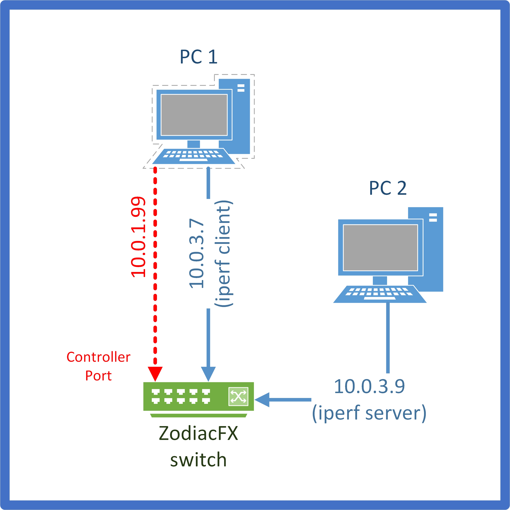

# Application Aware Switching with Zodiac FX

## Project Structure

```
├── README.MD          <- The top-level README for developers using this project.
├── report.pdf         <- Our report describing this work and the whole setup
├── Controller         <- The Ryu SDN controller.
├── Demo               <- A flask web application for demonstration of the project.
└── Firmware           <- The Zodiac FX firmware
    ├── README.md      <- Zodiac FX README/Instructions for building the firmware.
    ├── FirmwareBins   <- Custom firmware binaries ready to be flashed to the switch.
    └── FirmwareSrc    <- All firmware versions. Every folder contains a ChangesInThisVersion.md.
        ├── 0.85       <- The original ZodiacFX firmware in version 0.85.
        ├── A          <- Custom firmware A (without http server, OF 1.3 and VLAN matching/actions).
        ├── B          <- Custom firmware B (without port/flow/table stats).
        └── C          <- Custom firmware C (first matching flow instead of highest priority flow).
```

## Required Tools/Software

* extraputty (http://www.extraputty.com/) for flashing custom firmware via XMODEM
* HxD Hex-Editor (https://mh-nexus.de/de/hxd/) for editing custom firmware builds
* Atmel SAM-BA In-system Programmer (https://www.microchip.com/DevelopmentTools/ProductDetails/Atmel%20SAM-BA%20In-system%20Programmer) for resetting the firmware
* Atmel Studio 7 (https://www.microchip.com/mplab/avr-support/atmel-studio-7) for building the firmware
* iperf3 (https://iperf.fr/) for the throughput measurements

## Building/Flashing the Firmware to the Zodiac FX switch

The instructions below are based on the instructions available in the Zodiac FX README.

### Building the Firmware

* open the respective .atsln file with Atmel Studio 7
* build the "Release" configuration of the solution

### Prepare the Firmware

* flash the built binary
    * **Note: CLI will output that the firmware verification failed**
* In the root context, type the hidden 'get crc' command
    * **The two crc bytes for the firmware binary are returned**
* Append the crc to the binary with a hex editor (HxD)
* The firmware is now ready to be successfully flashed

### Flashing the Firmware

* **To update via the CLI (extraputty)**:
	* In the root context, type the 'update' command
	* When prompted, begin the firmware update via the XMODEM protocol
	* If the firmware update is successful, Zodiac FX will automatically restart to complete the update

## Setup
The following image shows the setup used for all measurements.


